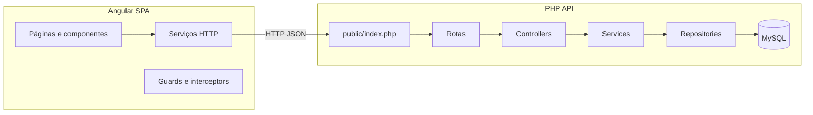

# Sistema de Planejamento de Viagens

Monorepo de laboratório com **Angular 17+** (frontend), **PHP 8+ sem frameworks** (API REST JSON) e **MySQL** (XAMPP). O objetivo é um produto credível de planeamento de viagens, com arquitetura limpa, separação de responsabilidades e boas práticas de engenharia de software.

## Estado actual (Fim da Fase 2 + Fase 3 — viagens e itinerário)

- **Git / env:** `backend/.env` não deve ser versionado (use `.env.example`). `APP_DEBUG=0` por defeito no exemplo. Para activar log local de reset de password, defina `APP_DEBUG=1` só no seu `.env` local.
- **HttpException:** `backend/exceptions/HttpException.php`; `AuthService::requireAuthenticatedUser()` / `requireAdminUser()` lançam excepção; `public/index.php` converte em JSON (sem `exit` no serviço).
- **API viagens:** CRUD `/api/v1/trips`, detalhe com itinerário embutido em `GET /api/v1/trips/{id}`; dias em `/api/v1/trips/{trip_id}/itinerary-days` e `/api/v1/itinerary-days/{id}`; actividades em `/api/v1/itinerary-days/{day_id}/activities` e `/api/v1/itinerary-activities/{id}`. Todas exigem Bearer.
- **Frontend:** `MainLayoutComponent` (navbar + sidebar responsiva), módulo lazy `trips` (lista, criar/editar, detalhe com dias e actividades).

Próximas fases: despesas/reservas (4), favoritos/notificações (5), APIs externas via PHP (6), i18n/tema/responsivo (7), export (8), admin/dashboard consolidado (9).

---

## Autenticação (API)

| Método | Rota | Descrição |
|--------|------|-----------|
| POST | `/api/v1/auth/register` | Corpo: `full_name`, `email`, `password` (mín. 8). |
| POST | `/api/v1/auth/login` | Corpo: `email`, `password`. Resposta inclui `token` e `user`. |
| POST | `/api/v1/auth/logout` | Cabeçalho `Authorization: Bearer <token>`. |
| GET | `/api/v1/auth/me` | Bearer obrigatório. |
| POST | `/api/v1/auth/forgot-password` | Corpo: `email`. Com `APP_DEBUG=1`, o token é escrito em `backend/storage/logs/password-reset-debug.log` (nunca na resposta JSON). |
| POST | `/api/v1/auth/reset-password` | Corpo: `token`, `password`. |

Criar administrador (exemplo):

```powershell
cd c:\xampp\htdocs\sistema-planejamento-viagens\backend
& "C:\xampp\php\php.exe" scripts/seed_admin.php admin@local.dev "Admin123!" "Administrador"
```

Variáveis opcionais no `.env`: `SESSION_TTL_HOURS`, `PASSWORD_RESET_TTL_MINUTES`. Copie `.env.example` para `.env` e ajuste credenciais MySQL.

---

## Viagens e itinerário (API)

| Método | Rota | Corpo / notas |
|--------|------|----------------|
| GET | `/api/v1/trips` | Lista viagens do utilizador. |
| POST | `/api/v1/trips` | `name`, `country`, `city`, `start_date`, `end_date`, `budget_amount`, `budget_currency`, `description?`, `status?` |
| GET | `/api/v1/trips/{id}` | Detalhe + `itinerary_days` com `activities` por dia. |
| PUT | `/api/v1/trips/{id}` | Mesmos campos que POST. |
| DELETE | `/api/v1/trips/{id}` | Elimina viagem (cascade no MySQL). |
| GET | `/api/v1/trips/{trip_id}/itinerary-days` | Lista dias. |
| POST | `/api/v1/trips/{trip_id}/itinerary-days` | `day_date`, `notes?`, `sort_order?` — data dentro do intervalo da viagem. |
| GET | `/api/v1/itinerary-days/{id}` | Um dia. |
| PUT | `/api/v1/itinerary-days/{id}` | Actualiza dia. |
| DELETE | `/api/v1/itinerary-days/{id}` | Remove dia. |
| GET | `/api/v1/itinerary-days/{day_id}/activities` | Lista actividades. |
| POST | `/api/v1/itinerary-days/{day_id}/activities` | `title`, `location_name?`, `start_time?`, `end_time?`, `sort_order?`, `notes?` |
| PUT | `/api/v1/itinerary-activities/{id}` | Actualiza actividade. |
| DELETE | `/api/v1/itinerary-activities/{id}` | Remove actividade. |

---

## Estado anterior (Etapa 0 — fundações)

- Modelo SQL completo inicial (`database/schema.sql`).
- API PHP com front controller, rotas versionadas (`/api/v1/...`), CORS, PDO com prepared statements.
- Frontend Angular com **lazy loading**, `HttpClient`, proxy e página de verificação da API em `/home`.


## Arquitetura do sistema

### Visão lógica



- **Cliente:** SPA Angular comunica apenas via HTTP/JSON. Em desenvolvimento, o `ng serve` usa `proxy.conf.json` para encaminhar `/api` ao Apache do XAMPP.
- **Servidor:** PHP atua como API REST stateless (sessões/tokens serão tratados nas etapas de autenticação). Entrada única em `backend/public/index.php`, despacho por tabela de rotas, controllers finos, serviços com regras, repositórios com SQL parametrizado.

### Camadas backend (PHP)

| Camada | Responsabilidade |
|--------|------------------|
| `public/` | Front controller, `.htaccess` (rewrite). |
| `routes/` | Definição declarativa de métodos HTTP e paths. |
| `controllers/` | Orquestração HTTP: validação básica, chamada a serviços, respostas JSON. |
| `services/` | Regras de negócio e composição de repositórios. |
| `repositories/` | Acesso a dados (PDO + prepared statements). |
| `models/` | Representação de dados / DTOs (evolução para entidades). |
| `middleware/` | Reservado para pipelines dedicados (`.gitkeep`). CORS em `helpers/cors.php`; Bearer em rotas com `requiresAuth` no `index.php`. |
| `helpers/` | `cors.php`, request, response, router, env, auth Bearer, logs de debug controlados. |
| `config/` | Configuração da aplicação e base de dados. |
| `uploads/` | Ficheiros geridos pela API (futuro). |

### Camadas frontend (Angular)

| Pasta | Uso |
|-------|-----|
| `core/` | `CoreModule`: `HttpClientModule`, interceptors HTTP (`Auth`, `Error`), serviços singleton (`AppNotificationsService`). |
| `shared/` | Componentes reutilizáveis, pipes, UI comum. |
| `modules/` | Feature modules com lazy loading. |
| `services/` | Clientes HTTP e façade da API. |
| `guards/` | Proteção de rotas (auth, papéis). |
| `interceptors/` | `AuthInterceptor` (Bearer), `ErrorInterceptor` (erros fora de `/api/v1/auth/*`). |
| `layouts/` | Shells (sidebar, navbar) — a implementar. |
| `components/` | Blocos reutilizáveis por página — a expandir. |

---

## Estrutura de pastas do repositório

```
sistema-planejamento-viagens/
├── README.md
├── .gitignore
├── database/
│   ├── schema.sql
│   └── seed_admin.sql
├── backend/
│   ├── .env
│   ├── .env.example
│   ├── config/
│   ├── controllers/
│   ├── helpers/
│   │   └── cors.php
│   ├── middleware/
│   ├── storage/
│   │   └── logs/   # password-reset-debug.log (APP_DEBUG), gitignore
│   ├── models/
│   ├── public/
│   ├── repositories/
│   ├── routes/
│   ├── scripts/
│   ├── services/
│   └── uploads/
└── frontend/
    ├── angular.json
    ├── package.json
    └── src/
        ├── proxy.conf.json
        └── app/
            ├── core/
            ├── shared/
            ├── modules/        # features lazy-loaded (home, auth, dashboard, admin)
            ├── services/
            ├── guards/
            ├── interceptors/
            ├── layouts/
            └── components/
```

---

## Planeamento técnico (fases)

1. **Fundações:** DDL, API mínima, Angular com proxy e verificação de `/api/v1/status`.
2. **Autenticação:** registo, login, logout, recuperação, tokens em `user_sessions`, guards Angular e rotas com `requiresAuth` no PHP.
3. **Viagens e itinerário:** CRUD e validações.
4. **Despesas e reservas fictícias.**
5. **Favoritos e notificações.**
6. **Integrações externas** (clima, país, câmbio).
7. **UX global:** tema claro/escuro, i18n, layout, toasts.
8. **Exportação:** PDF e CSV.
9. **Admin:** gestão de utilizadores e conteúdos.

---

## Requisitos

- XAMPP (Apache + MySQL + PHP 8+).
- Node.js 18+ e npm.
- Git e GitHub.

---

## Instalação

### Base de dados

```sql
CREATE DATABASE travel_planning CHARACTER SET utf8mb4 COLLATE utf8mb4_unicode_ci;
```

Importe `database/schema.sql` no phpMyAdmin ou cliente MySQL.

### Backend

Ajuste `backend/.env` se necessário. URL típica:

`http://localhost/sistema-planejamento-viagens/backend/public/`

### Frontend

```powershell
cd c:\xampp\htdocs\sistema-planejamento-viagens\frontend
npm install
npm start
```

Abra `http://localhost:4200/home`. O proxy em `src/proxy.conf.json` envia `/api` para o PHP — altere o `target` se o caminho do XAMPP for diferente.

---

## Testes da Etapa 0

1. `GET .../backend/public/api/v1/health` — JSON de saúde.
2. `GET .../backend/public/api/v1/status` — inclui `database: ok` se a BD existir.
3. Página `/home` no Angular com a mesma informação.

---

## Boas práticas aplicadas

- Configuração externa (`.env`), CORS com lista branca, rotas versionadas, PDO sem emulação de prepares, Angular strict e lazy loading.

---

## Erros comuns

- **404:** URL não aponta para `public` ou `mod_rewrite` off.
- **503 em status:** BD não criada ou credenciais erradas.
- **Frontend sem dados:** Apache parado ou `proxy.conf.json` incorreto.

---

## Commits (exemplos)

- `feat(api): add versioned health and status routes`
- `chore(db): add initial travel planning schema`
- `feat(auth): add bearer session auth and angular guards`

---

## Próximo passo

Confirmar autenticação (registo, login, admin seed, recuperação em modo debug). Em seguida: **Fase 3 — CRUD de viagens e itinerário**.

